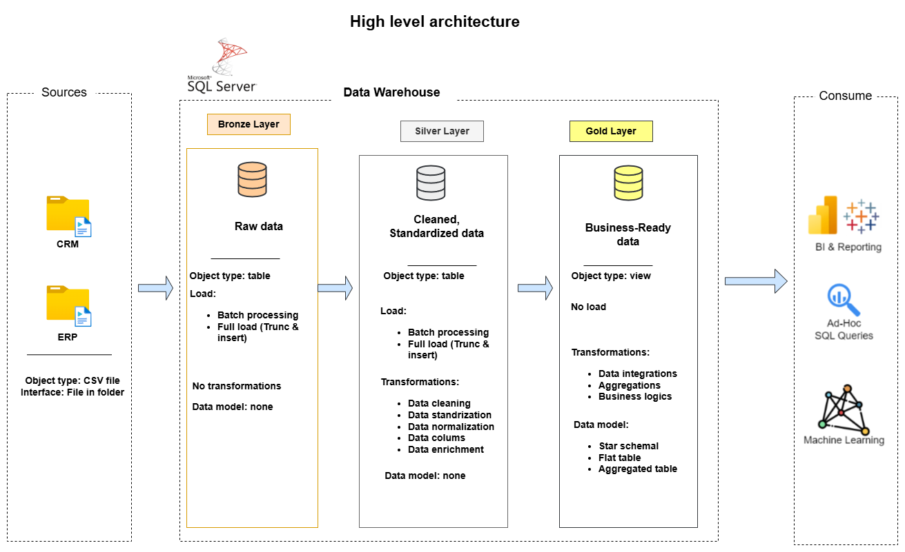

# 📊 SQL Data Warehouse Project

Building a modern **Data Warehouse** using **Microsoft SQL Server**, including ETL processes, data modeling, and analytical reporting.

---
🏗️ Data Architecture
The data architecture for this project follows Medallion Architecture Bronze, Silver, and Gold layers:
# 🏗 Data Architecture

Bronze Layer: Stores raw data as-is from the source systems. Data is ingested from CSV Files into SQL Server Database.
Silver Layer: This layer includes data cleansing, standardization, and normalization processes to prepare data for analysis.
Gold Layer: Houses business-ready data modeled into a star schema required for reporting and analytics.

---
# 📖 Project Overview

This project focuses on building a modern **Data Warehouse** to consolidate and transform sales data from multiple business systems into a centralized analytical platform.

The goal is to demonstrate how **raw operational data** from different systems can be transformed into **business-ready datasets** that support analytics, reporting, and data-driven decision-making.

---

# 🗂 Data Sources

The data used in this project comes from two business systems:

* **Customer Relationship Management (CRM)**
* **Enterprise Resource Planning (ERP)**

These systems export operational data in **CSV format**, which is ingested into the data warehouse.

---

## 📁 Source Files

| File                | Description                             |
| ------------------- | --------------------------------------- |
| `cust_info.csv`     | Customer information from CRM           |
| `prd_info.csv`      | Product information                     |
| `sales_details.csv` | Sales transaction data                  |
| `CUST_AZ12.csv`     | Additional customer attributes from ERP |
| `LOC_A101.csv`      | Customer location data                  |
| `PX_CAT_G1V2.csv`   | Product category mapping                |

These datasets represent key business entities such as:

* Customers
* Products
* Sales transactions
* Product categories
* Customer locations

---

# 🏗 Data Architecture

The project follows the **Medallion Architecture**, consisting of three layers:

* 🥉 **Bronze Layer**
* 🥈 **Silver Layer**
* 🥇 **Gold Layer**

This architecture progressively improves data quality and prepares data for analytics.

---

# 🥉 Bronze Layer — Raw Data

The **Bronze layer** stores raw data ingested directly from the source CSV files.

### Characteristics

* Data is loaded **as-is**
* No transformations are applied
* Tables mirror the structure of the source systems
* Data ingestion uses **bulk loading**

### Purpose

* Preserve original source data
* Maintain data traceability
* Provide a reliable backup of raw data

---

# 🥈 Silver Layer — Cleaned & Standardized Data

The **Silver layer** focuses on data cleaning and transformation.

### Typical Transformations

* Removing duplicate records
* Handling missing values
* Standardizing categorical values (e.g., gender, marital status)
* Data type conversion
* Creating derived columns
* Data normalization

At this stage, the data becomes **clean, consistent, and ready for analysis**.

---

# 🥇 Gold Layer — Business-Ready Data

The **Gold layer** contains analytical data models optimized for reporting and analytics.

### Key Characteristics

* Business logic applied
* Data integration across **CRM** and **ERP** sources
* Aggregations and metrics
* Analytical data structures

### Data Models May Include

* Star schema
* Fact tables
* Dimension tables

This layer is designed for:

* Business Intelligence reporting
* Analytical queries
* Data exploration

---

# 📊 Analytics Use Cases

The data warehouse enables analysis across several business domains.

## Customer Analysis

* Customer demographics
* Customer segmentation
* Customer purchase behavior

## Product Performance

* Best-selling products
* Product category performance
* Revenue by product line

## Sales Analysis

* Sales trends over time
* Order and shipment performance
* Revenue and quantity analysis

---

# ⚙️ Technologies Used

* SQL development using **Microsoft SQL Server**
* Data ingestion from CSV files
* ETL pipelines implemented using SQL
* Data modeling techniques used in **Data Warehouse systems**

---

# 🎯 Learning Objectives

This project demonstrates practical skills in:

* SQL development
* Data ingestion and ETL pipelines
* Data cleaning and transformation
* Data warehouse architecture
* Data modeling for analytics

It is designed as a **hands-on learning project** for students and professionals interested in:

* Data Engineering
* Data Analytics
* Data Architecture
* Business Intelligence
  
